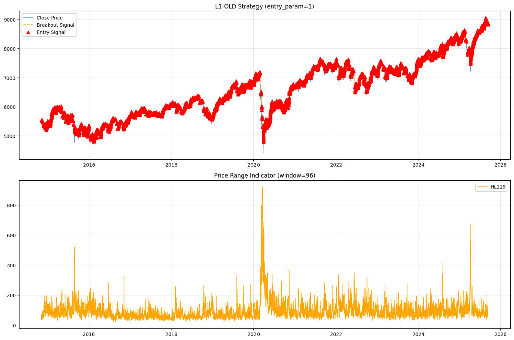
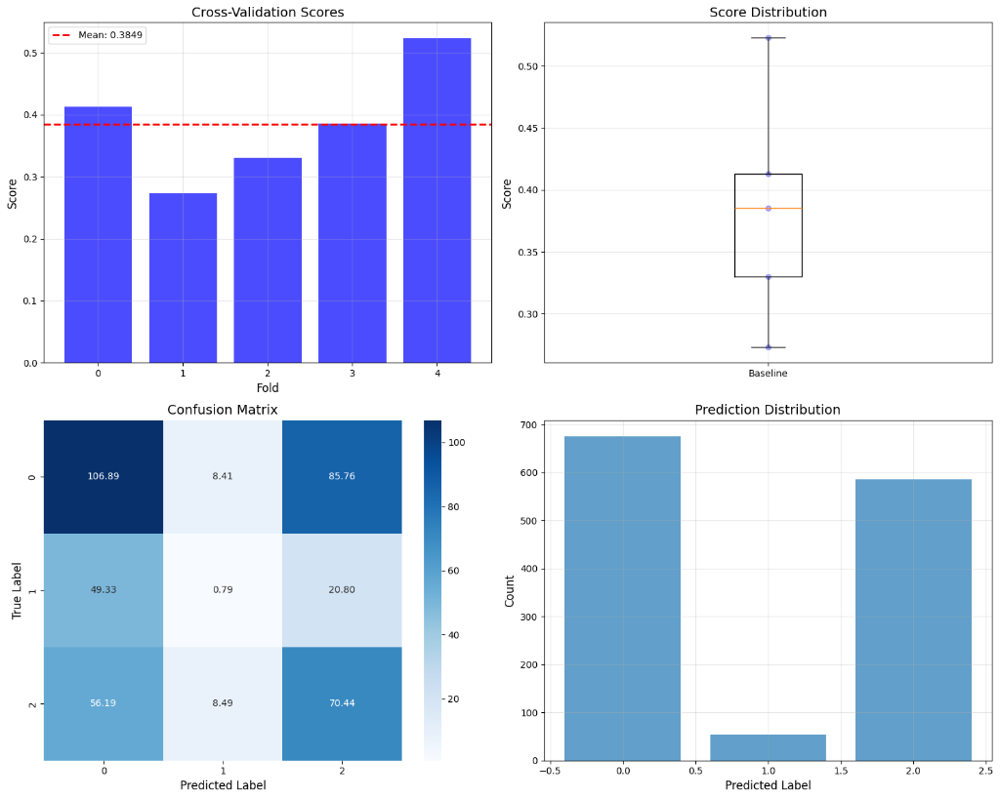
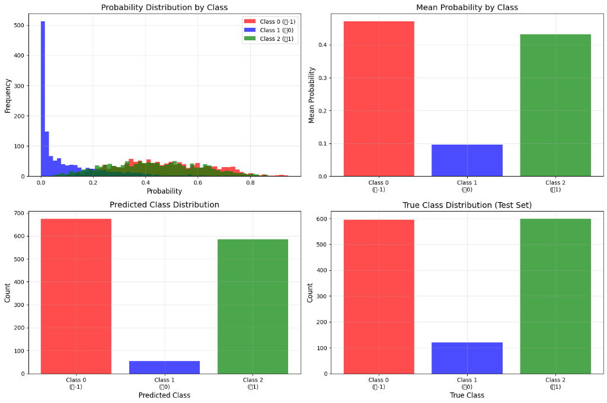

# MetaLabel 學習策略：核心邏輯與完整架構

本文件闡述 Meta-Labeling (元標籤) 策略的核心設計策略體系、多元特徵工程以及嚴謹的驗證架構。我們透過機器學習過濾雜訊，提升交易品質。

## 1. 策略核心哲學 (Strategy Philosophy)

傳統學習往往在所有KBAR時皆進預測，導致學習困難。Meta-Labeling 的核心精神在於 **「二次過濾」**：
1.  **初級信號 (Primary Model)**：由技術指標產生高頻進場點（如突破、交叉），捕捉市場動能。
2.  **元模型 (Meta Model)**：由 AI 判斷當下環境是否有利，作為重要時刻的方向預測。

*(圖示：原始價格走勢與 AI 篩選後的精準進場點)*

## 2. 四大策略體系 (Strategy Ecosystem)

本專案包含四種不同邏輯的初級策略，涵蓋趨勢與反轉：

1.  **MetaNewHigh (新高策略)**
    *   **邏輯**：追蹤價格突破近期高點的動能。
    *   **特性**：順勢交易，適合趨勢強勁的市場。
2.  **MetaNewLow (新低策略)**
    *   **邏輯**：追蹤價格跌破近期低點的動能（做空）。
    *   **特性**：順勢交易，捕捉恐慌性拋售或空頭趨勢。
3.  **MetaMaCrossUp (均線黃金交叉)**
    *   **邏輯**：短期均線向上穿越長期均線。
    *   **特性**：經典趨勢確認信號，過濾掉短期波動。
4.  **MetaMaGranville (葛蘭碧八大法則)**
    *   **邏輯**：基於均線的乖離與回歸特性（如回測均線不破、乖離過大）。
    *   **特性**：結合順勢與逆勢（回歸）的綜合策略。

## 3. 多元特徵工程 (Diverse Feature Engineering)

我們構建了極為豐富的特徵池，從不同維度捕捉市場細微的變化。系統支援以下九大類特徵：

### A. 九大特徵類別 (Feature Categories)
1.  **分數階差分 (Fractional Differentiation)**：解決傳統差分造成記憶丟失的問題，保留長記憶性同時達成平穩性。
2.  **技術指標 (Technical Indicators)**：包含 ATR、RSI、Bollinger Bands 等經典指標，捕捉價格形態。
3.  **波動率指標 (Volatility Indicators)**：捕捉市場的恐慌程度與價格變動的劇烈程度。
4.  **市場指標 (Market Indicators)**：反映整體市場的寬度與深度。
5.  **熵與資訊指標 (Entropy & Information)**：利用資訊理論捕捉價格序列的混亂度與複雜度。
6.  **微結構特徵 (Microstructure)**：從更細微的 Tick 等級量價結構中提取資訊（如 VCI）。
7.  **統計指標 (Statistical Features)**：基於統計學分佈的特徵（如偏態、峰態）。
8.  **高頻特徵 (HFT Indicators)**：來自高頻數據的買賣壓不平衡與訂單流資訊。
9.  **時間因子 (Time Factors)**：捕捉日內與週內的季節性效應。

### B. 嚴謹的特徵因子篩選 (Selection Funnel)
透過多層次篩選，我們從海量特徵中精煉出關鍵因子：

1.  **相關性過濾 (Correlation Filter)**：移除高度重疊的冗餘資訊。
2.  **變異數閾值 (Variance Threshold)**：剔除幾乎不變的無效特徵。
3.  **IC 預測力排名 (IC Ranking)**：僅保留與獲利目標具備實質相關性的特徵。
4.  **統計顯著性檢定 (Statistical Tests)**：確保特徵的預測力具有統計上的顯著意義。

> **核心目標**：從上述九大面向中，找出真正「驅動獲利」的關鍵少數，並減少過多因子的維度爆炸與過擬合風險。

## 4. 執行模型與實證 (Execution & Empirical Study)

我們採用嚴格的 **滾動視窗 (Rolling Window)** 進行回測，確保模型能適應市場結構的改變。

### A. 執行商品 (Executed Commodities)
本專案已對全球主要指數商品完成完整實證：
*   **美股**：`NAS100` (那斯達克), `SPX500` (標普500), `US2000` (羅素2000)
*   **亞股**：`HKG33` (恆生), `JPN225` (日經), `AUS200` (澳洲)
*   **歐股**：`GER30` (德指), `FRA40` (法指), `ESP35` (西班牙)

### B. 預測配置 (Prediction Config)
*   **訓練起始**：2014-11-01
*   **預測起始年份**：2019
*   **滾動視窗**：7 年 (保持最新的市場記憶)

### C. 執行模型 (Execution Models)
我們部署了多樣化的機器學習模型進行集成與比較，包含：
1.  **XGBoost** (極致梯度提升)
2.  **LightGBM** (輕量級梯度提升)
3.  **CatBoost** (類別特徵專家)
4.  **Random Forest** (隨機森林 - 基準模型)
5.  **Extra Trees** (極端隨機樹)
6.  **Decision Tree** (決策樹)
7.  **SVM** (支持向量機)
8.  **Logistic Regression** (邏輯回歸)
9.  **Naive Bayes** (單純貝氏)

所有模型皆透過 **Purged K-Fold Cross-Validation** 進行超參數優化 (`clfHyperFit`)，確保最佳化過程沒有未來數據洩漏。

## 5. 驗證與績效 (Validation & Performance)

我們採用**Purged K-Fold with Embargo**：
*   **Purging (淨化)**：剔除訓練集中與測試集時間重疊的樣本。
*   **Embargo (禁制)**：測試期後強制隔離一段時間，切斷長記憶相關性。

*(圖示：模型學習到的獲利(1)、虧損(-1)與超時(0)標籤分佈)*

## 6. 結果範例與視覺化 (Result Visualization)

### 交叉驗證與混淆矩陣
我們關注模型在不同時間區段的穩定性 (Cross-Validation Scores) 以及預測類別的準確度 (Confusion Matrix)。重點在於**減少假突破 (False Positives)**，即盡量避免將虧損交易預測為獲利。

### 機率分佈與信心水準
模型輸出的不只是「買/不買」，而是「獲利的機率」。下圖展示了模型對不同類別的信心分佈。一個健康的模型，其獲利預測的機率分佈應顯著高於隨機猜測。

---
*詳細代碼實作請參閱各策略目錄下的 Jupyter Notebook。*
